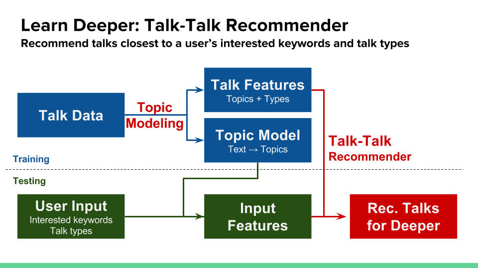
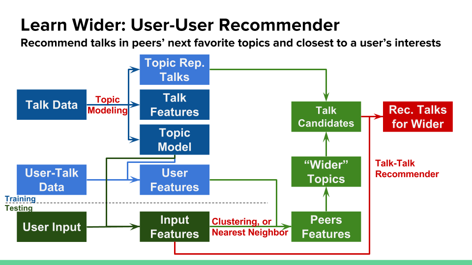

# DiscoverTED: A TED Talk Recommender to Learn Deeper and Wider

This is a 2-week capstone project for my Galvanize Data Science Immersive program. 
The goal is to build a TED talk recommender for people to learn deeper and
wider topics. The project is still working in progress.

While I am trying to be an expert in data science, I would also like to keep an
eye on the world. Learning some new topics stimulate my thoughts and adds
diversity to my life! [TED.com](https://www.ted.com/) is one of my favorite resources 
to learn. Thus, I would like to build the TED recommender that helps me explore new 
topics that I will potentially like.

Here is a sample result from DiscoverTED.

## Data
The data is mainly sourced from [Idiap TED dataset](https://www.idiap.ch/dataset/ted) 
and [ted.com](https://ted.com). 
- Idiap: Scraped as of Sep 2012. Includes data of both users and talks (except talk ratings).
- Rating: Scraped as of Nov 2016 from ted.com
- Exploratory Data Analysis (EDA):
    - Total 12,401 users
    - Total 6,449 active users (users with 4+ favorite talks). 52% of total users
    - Total 2,318 talks (1,201 talks are favorited)
    - Average # favorate talks per user = 9.3
    - Average # users per talk favorited = 84.3

## Methodology
DiscoverTED is an ensamble recommender based on both **talk-talk recommender** for
talks to learn deeper and **user-user recommender** for talks to learn wider.
Users have to enter some keywords to describe their interested topics (say,
"machine learning big data") and target talk types (say, "Informative" talks).
Then, DiscoverTED will recommend two talks to learn deeper and two talks to learn
wider.

### Talk-Talk Recommender for Deeper Topics
For the talk-talk recommender, the talks are modeled into `k` topics based on
their description and tags. The recommended talks are the most similar talks
based on users' inputs.

To model the talk topics, I choose to use 
**Natural language processing (NLP) + Latent Dirichlet Allocation (LDA)** 
on talk descriptions. These texts are tokenized and stemized. Punctuation and 
stop words are removed. This model gives better recommendations than matrix
factorization (MF) as MF does not work well when the input data is very sparse.
The MF models I have tried include non-negative MF and graphlab's MF.

Pipeline for the talk-talk recommender.

### User-User Recommender for Wider Topics
For the user-user recommender, users are modeled into groups based on their
interested keywords and preferred talk types, and representative talks are 
picked for each topic based on the topic modeling results. 
The target "wider" topics are the next favorite `w` topics of all users in the same group. 
The recommended talks are the most similar talks to users' input 
from the representative talks of the wider topics.

To model the user groups, I choose to use **Nearest Neighbor** based on users'
keywords and preferred talk types. For each user, `n` nearest existing users
are identified as the peers. Similar to the talk-talk recommender, this model 
gives better recommendations than matrix factorization (MF) 
as MF does not work well when the input data is very sparse. 
Also, it works better than k-mean clustering as users around the clustering boundary
may be more closer to the users on the other side of the boundary than the
users with the same clustered labels.

Pipeline for the user-user recommender.

## Evaluation
Evaluation can be challenging for the recommendation system. One way to
evaluate my recommender is to ask: is my recommender bringing the topics a user
is interested?

## Acknowledge
- Nikolaos Pappas, Andrei Popescu-Belis, "Combining Content with User
  Preferences for TED Lecture Recommendation", 11th International Workshop on
  Content Based Multimedia Indexing, Veszpré Hungary, IEEE, 2013 
  [PDF](http://publications.idiap.ch/downloads/papers/2013/Pappas_CBMI_2013.pdf)
  [Bibtex](http://publications.idiap.ch/index.php/export/publication/2564/bibtex)
